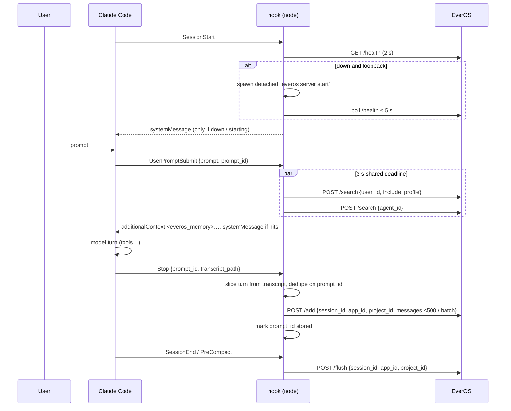

# EverOS Claude Code Plugin — Design

Persistent, cross-session memory for Claude Code, backed by a local EverOS
server. A sibling of the OpenClaw / Hermes / DSH plugins in this repository:
same backend contract (`/api/v2/memory/*`), same lifecycle
(recall → capture → seal), same fail-open promise.

## Contents

- [1. Goal and non-goals](#1-goal-and-non-goals)
- [2. Decisions](#2-decisions)
- [3. Architecture](#3-architecture)
- [4. File layout](#4-file-layout)
- [5. Identity mapping](#5-identity-mapping)
- [6. Runtime flows](#6-runtime-flows)
  - [6.1 SessionStart — detect, start, report](#61-sessionstart--detect-start-report)
  - [6.2 UserPromptSubmit — recall](#62-userpromptsubmit--recall)
  - [6.3 Stop — capture one turn](#63-stop--capture-one-turn)
  - [6.4 SessionEnd / PreCompact — seal](#64-sessionend--precompact--seal)
- [7. Transcript → EverOS message mapping](#7-transcript--everos-message-mapping)
- [8. Configuration](#8-configuration)
- [9. Failure policy](#9-failure-policy)
- [10. Skills](#10-skills)
- [11. Testing](#11-testing)
- [12. Acceptance](#12-acceptance)
- [13. Distribution](#13-distribution)
- [14. Out of scope](#14-out-of-scope)

## 1. Goal and non-goals

**Goal.** A Claude Code user who runs a local EverOS gets memory without
doing anything: relevant memories are injected before every prompt, every
finished turn is saved with its full tool-call trajectory, and the session
buffer is sealed when the session ends. Engineering decisions made in one
session ("this repo uses ruff, not black") are recalled in later sessions of
the same repository.

**Primary user.** EverOS developers dogfooding from a checkout. External
`pip install everos` users are supported by the same code path, but the
install documentation is written for the checkout case first.

**Non-goals for v1.**

| Not doing | Why |
|---|---|
| EverOS Cloud backend | Covered by `evermem-claude-code`; a dual-backend plugin doubles the config and error surface. `base_url` stays configurable but Cloud is neither promised nor tested. |
| MCP tools (`memory_search`, `memory_store`) | Contradicts the "you just chat" model shared by every plugin here; adds a long-lived process. |
| npm publication | Claude Code installs plugins from git. |
| Installer CLI (`everos-setup`) | OpenClaw needed one to claim its memory slot and restart the gateway. Claude Code has neither step; `/everos:status` tells the user what is missing. |
| Global (cross-project) memory | `/add` writes exactly one `project_id`; the plugin cannot decide which sentences are preferences and which are project decisions. That is algorithm-layer work. |

## 2. Decisions

| # | Decision | Choice | Rationale |
|---|---|---|---|
| D1 | Location | `Plugins/claude-code/` | Shares the local-EverOS contract, README table, and per-plugin CI pattern with its siblings. |
| D2 | Runtime | Node ≥ 20, zero runtime dependencies (native `fetch`) | Hooks are shell commands; a Python hook would have to pick an interpreter on machines we do not control. All three existing Claude Code memory plugins are Node. |
| D3 | Interaction model | Hooks do everything; two user-invocable skills (`status`, `search`) | Automatic recall/capture is the value; `status` is a troubleshooting necessity; `search` is an explicit-recall fallback. |
| D4 | What is captured | Full trajectory: user text, assistant text, `tool_calls`, tool results | everalgo's case extraction skips trajectories with fewer than 3 tool-call rounds and does its own head+tail truncation of tool output. Sending less would mean no agent memory at all. |
| D5 | Partitioning | Per project: `project_id` = repository name | Mirrors OpenClaw (`workspaceDir` basename). All worktrees of one repository share memory (see §5). |
| D6 | Auto-start | Detect, then spawn a detached `everos server start`; wait up to 5 s | Accepted trade-off: the spawned server is an orphan process that outlives the hook and the Claude Code session. EverOS's OME single-instance lock makes concurrent spawns from several windows harmless. |
| D7 | Configuration | `EVEROS_CC_*` env > Claude Code `userConfig` > defaults; no plugin-owned file | `userConfig` is the host-native slot (Claude Code prompts on enable, stores in `~/.claude/settings.json`, exports `CLAUDE_PLUGIN_OPTION_*` to hooks). Same precedence as OpenClaw's `plugins.entries.<id>.config`. |
| D8 | Recall latency | 5 s shared deadline for both searches, `EVEROS_CC_RECALL_TIMEOUT_MS` to change it; hook timeout 10 s | Planned at 3 s to protect typing latency, **raised after live runs**: two of the first three real sessions lost their opening recall to that budget. A warm search is 0.3-0.8 s so the budget is almost never spent, and a recall that times out costs the whole feature for that turn while a slow one costs a moment. |
| D9 | User-visible output | Recall hit line when hits > 0; warning line when EverOS is down; nothing on Stop | Shows value without a line per turn. Silent memory loss is the failure mode the OpenClaw handoff warns about most. |
| D10 | Seal points | `SessionEnd` and `PreCompact`; no periodic flush | Periodic flush would fight EverOS's own topic-boundary detection. Compaction is a natural boundary. |
| D11 | Turn dedupe | `prompt_id` from hook stdin, state under `${CLAUDE_PLUGIN_DATA}` | `Stop` can fire twice for one prompt (interrupt, resume). EverOS's buffer does not dedupe. |
| D13 | Cold first recall | SessionStart fires one throwaway search to warm the path | The session's first prompt is where memory matters most and where the cold cost landed. This hook has a 15 s budget and nobody waiting on it. |
| D14 | Unsealed sessions | A later session seals any session untouched for 10 minutes, under the project id it ran in | Claude Code cancels `SessionEnd` when the host exits in a hurry, routine under `claude -p`, stranding the turns after the last topic boundary. Self-healing beats a guarantee we cannot make. |
| D15 | Case rendering | Inject `task_intent` + `key_insight`, not `approach`; cap every rendered line at 300 chars | A real case's `approach` is a numbered walkthrough over 1500 characters. At prompt time the distilled lesson helps; `/everos:search` is where the detail belongs. |
| D12 | Prompt-injection story | Port OpenClaw `render` verbatim | Fenced `<everos_memory>` block, "untrusted historical data" label, fence-token neutralisation, position-0 strip before capture. Do not reinvent. |

## 3. Architecture

```
Claude Code ──hooks.json──▶ node hooks/scripts/*.js ──HTTP──▶ EverOS  127.0.0.1:8000
   │                              │                              /api/v2/memory/{add,search,flush}
   │ stdin: session_id,           │ lib/everos.js   (client)     /health
   │        prompt_id,            │ lib/transcript.js (JSONL → messages)
   │        transcript_path, cwd  │ lib/render.js   (memory block)
   │                              │ lib/state.js    (dedupe)
   ◀── stdout: hookSpecificOutput │ lib/config.js   (env / userConfig)
       .additionalContext,        │ lib/provision.js (detect → spawn)
       systemMessage              ▼
                            ${CLAUDE_PLUGIN_DATA}/  state/<session_id>.json
                                                   everos-server.log
                                                   debug.log
```

One EverOS serves every host; this plugin's writes and reads are partitioned
from OpenClaw's and Hermes's only by `app_id = "claude-code"`. Always HTTP,
never an import of the Python backend (OME holds a single-instance lock).

## 4. File layout

```
Plugins/
├── .claude-plugin/marketplace.json        # new: marketplace "everos" → ./claude-code
├── .github/workflows/claude-code.yml      # node --test + claude plugin validate
└── claude-code/
    ├── .claude-plugin/plugin.json         # name "everos", userConfig (§8)
    ├── hooks/
    │   ├── hooks.json
    │   └── scripts/
    │       ├── session-start.js           # §6.1
    │       ├── recall.js                  # §6.2
    │       ├── capture.js                 # §6.3
    │       ├── flush.js                   # §6.4
    │       └── lib/
    │           ├── hook-io.js             # read stdin JSON, write stdout JSON, exit 0 always
    │           ├── config.js
    │           ├── identity.js            # app/project/user/agent/session ids (§5)
    │           ├── everos.js              # fetch client, deadline, error type
    │           ├── transcript.js          # JSONL → EverOS messages (§7)
    │           ├── query.js               # prompt → search query (noise strip, clip)
    │           ├── render.js              # search results → <everos_memory> block
    │           ├── state.js               # per-session dedupe file
    │           └── provision.js           # health probe, detached spawn
    ├── skills/
    │   ├── status/SKILL.md               # invoked as /everos:status
    │   └── search/SKILL.md               # invoked as /everos:search
    ├── scripts/
    │   ├── status.js                      # used by the status skill
    │   ├── search.js                      # used by the search skill
    │   └── e2e.sh                         # manual acceptance (§12)
    ├── tests/
    │   ├── fixtures/                      # sanitised real transcripts + hook stdin samples
    │   ├── fake-everos.js                 # in-process node:http recorder
    │   └── *.test.js
    ├── package.json                       # "@everos-ai/claude-code-plugin", private: true
    ├── README.md / README_zh.md
    └── docs/DESIGN_DOC.md                 # this file
```

`hooks/hooks.json`:

| Event | Matcher | Script | Timeout |
|---|---|---|---|
| `SessionStart` | `*` | `session-start.js` | 15 s |
| `UserPromptSubmit` | `*` | `recall.js` | 10 s |
| `Stop` | `*` | `capture.js` | 30 s |
| `SessionEnd` | `*` | `flush.js` | 30 s |
| `PreCompact` | `*` | `flush.js` | 30 s |

Every command is `node "${CLAUDE_PLUGIN_ROOT}/hooks/scripts/<name>.js"`.

## 5. Identity mapping

`/add` carries no identity fields; identity is derived per message from
`sender_id`. `/search` requires exactly one of `user_id` / `agent_id`. Ids used
for capture must match ids used for recall exactly, or search silently
returns nothing.

| EverOS field | Value | Source / override |
|---|---|---|
| `app_id` | `claude-code` (constant) | Cross-host partition; not configurable. |
| `project_id` | Host, owner and repository | 1. `git config --get remote.origin.url` → the last three segments joined (`github.com_EverMind-AI_Plugins`); 2. else `git rev-parse --show-toplevel` basename; 3. else `cwd` basename. Sanitised to `^[a-zA-Z0-9_.@+-]+$` (others → `_`), `.`/`..` rejected, clipped to 128, fallback `default`. Override: `EVEROS_CC_PROJECT_ID`. Resolved once per hook from stdin `cwd`. |
| `sender_id` (role `user`) = `user_id` | `$USER` → `$USERNAME` → `os.userInfo().username` | Override: `EVEROS_CC_USER_ID`. Unset ⇒ user track disabled with a warning (OpenClaw behaviour). |
| `sender_id` (role `assistant`/`tool`) = `agent_id` | `claude-code` (constant) | Cases and skills land in `agents/claude-code/` under the project. |
| `session_id` | Claude Code `session_id` from stdin, clipped to 128 | Buffer key only, not a directory. |

Rule 1 for `project_id` exists because of worktree slots (`~/EverOS`,
`~/EverOS-a`, `~/EverOS-b`): decisions made in one slot must be recalled in
the others. The remote is more stable than the main worktree's directory name,
and every clone URL of a repository normalises to the same id.

Host and owner are part of the id because the bare repository name is not a
namespace. Two `api` repositories from different owners are ordinary, and
under a bare name they would share one partition — each reading the other's
decisions into its prompts, and a hostile clone able to write into yours.

On-disk result: `<root>/claude-code/<project_id>/users/<user_id>/` and
`<root>/claude-code/<project_id>/agents/claude-code/`.

## 6. Runtime flows



### 6.1 SessionStart — detect, start, report

1. `GET /health`, 2 s timeout. Healthy ⇒ exit silently.
2. If unhealthy and `base_url` host is loopback: spawn `start_cmd` (default
   `everos server start`) with `cwd = everos_dir` (if set), `detached: true`,
   stdio redirected to `${CLAUDE_PLUGIN_DATA}/everos-server.log`, then
   `unref()`. Environment adds `EVEROS_MEMORIZE__MODE=agent` (otherwise the
   agent track is silently empty) and `EVEROS_API__PORT` derived from
   `base_url`.
3. Poll `/health` every 500 ms for up to 5 s.
4. `systemMessage`: `⚡ EverOS started` / `⏳ EverOS starting in background —
   memory resumes when it is up` / `⚠️ EverOS unreachable at <base_url>; run
   /everos:status`. Never blocks the session.

5. Once the server answers, run one throwaway `/search` (5 s budget) to warm
   the path, so the session's first prompt is not the one that pays the cold
   cost. Failure is not reported; whether memory works is what the recall hook
   will say.
6. Seal any session left untouched for 10 minutes and never flushed, using the
   `project_id` recorded with that session rather than this one's — the
   abandoned session may have run in a different repository. At most 5 per
   start, and the sweep stops at the first error rather than hammering a sick
   server.

Budget arithmetic against the 15 s hook timeout: health 2 s + start wait 5 s +
warm-up 5 s leaves 3 s of margin.

Not loopback ⇒ never spawn; report unreachable only. A second window
spawning concurrently is rejected by EverOS's OME lock and exits; the first
instance serves both.

### 6.2 UserPromptSubmit — recall

1. Skip when the prompt starts with `/` or has fewer than 3 tokens after noise
   stripping (CJK-aware token count).
2. Build the query (`lib/query.js`): strip `<system-reminder>`,
   `<ide_selection>`, `<command-*>`, `<everos_memory>` echoes and caveat
   preambles; fold fenced code blocks and runs longer than 400 chars to `[…]`;
   head-clip to 500 chars. The current prompt is never truncated in favour of
   history (`queryN = 1`, as OpenClaw).
3. Two parallel `POST /search`, one per track, each with its own `.catch`:
   user track `{user_id, app_id, project_id, query, include_profile: true}`;
   agent track `{agent_id, app_id, project_id, query}`. `top_k`, `method`,
   `radius` are not sent — EverOS defaults own them. Shared 3 s deadline.
4. Render (`lib/render.js`, ported from OpenClaw): sections *Developer
   profile / Relevant past episodes / Relevant cases / Relevant skills*, at
   most 5 items each, one `- ` line per item, fence tokens neutralised,
   wrapped in `<everos_memory>` with the untrusted-data notice.
5. Output `{"hookSpecificOutput": {"hookEventName": "UserPromptSubmit",
   "additionalContext": <block>}, "systemMessage": "🧠 EverOS: 2 episodes ·
   1 case · profile"}`. No hits ⇒ no output at all.

### 6.3 Stop — capture one turn

1. Read stdin: `session_id`, `prompt_id`, `transcript_path`, `cwd`.
2. `lib/state.js`: if `prompt_id` is already recorded for this session, exit.
3. `lib/transcript.js`: read the JSONL; the turn runs from the **first** entry
   whose `promptId` equals `prompt_id` to the entry before the next differing
   `promptId`, skipping `isSidechain: true` entries. Every entry in a turn
   repeats that id and assistant entries carry none, so the first match is the
   start; the upper bound matters because a prompt queued mid-turn is already
   on disk when Stop fires. Retry until the turn reads as finished — its last
   conversational entry is an `assistant` entry — for up to 2 s, because the
   closing entry lands a fraction of a second after Stop. An interrupted turn
   never gets that entry, so the last attempt captures whatever is there.
4. Map to EverOS messages (§7). Drop the turn if it yields no message.
5. `POST /add` in batches of ≤ 500 messages, sequentially. Response `status`
   is ignored beyond success (`accumulated` and `extracted` are both fine).
6. Record `prompt_id` in the state file only after every batch succeeded, so
   a failed turn is retried by the next `Stop` for the same prompt if the
   host re-fires it. A dropped turn is otherwise lost — no queue (same as
   OpenClaw).
7. No stdout.

### 6.4 SessionEnd / PreCompact — seal

`POST /flush {session_id, app_id, project_id}`; `project_id` is recomputed
from stdin `cwd` (stable within a session). Fail-open, no output. Both
events call the same script; flushing twice is idempotent on the EverOS side
(`no_extraction` on an empty buffer).

## 7. Transcript → EverOS message mapping

Claude Code transcripts are JSONL under `~/.claude/projects/<slug>/<session_id>.jsonl`.
Entries carry `type`, `uuid`, `parentUuid`, `isSidechain`, `timestamp` (ISO),
`cwd`, and for `user`/`assistant` a `message: {role, content}` where `content`
is a string or an array of blocks. Tool calls and results are **blocks**, not
top-level entries. User entries additionally carry `promptId`.

| Transcript | EverOS message |
|---|---|
| `user` entry carrying a `promptSource` (a real prompt: `typed` in a terminal, `sdk` from the IDE) | `{role: "user", sender_id: <user_id>, content: <text joined by "\n\n">}`; a leading `<everos_memory>…</everos_memory>` block is stripped first (self-ingestion guard) |
| `user` entry with neither `promptSource` nor `tool_result` blocks — skill-body injections (`isMeta`), slash-command scaffolding, caveat preambles | dropped; the user never wrote it |
| consecutive `assistant` entries sharing a `requestId` | merged into one message, so its `tool_calls` array precedes the matching `tool` messages. Claude Code splits one API turn into one entry per block, and parallel tool calls arrive as several `tool_use` entries under one id |
| `assistant` entry, `text` blocks | `{role: "assistant", sender_id: "claude-code", content: <text>}` |
| `assistant` entry, `tool_use` blocks | appended to the same assistant message as `tool_calls: [{id, type: "function", function: {name, arguments: JSON.stringify(input)}}]`; `content` may be `""` |
| `user` entry, `tool_result` blocks | one `{role: "tool", sender_id: "claude-code", tool_call_id: <tool_use_id>, content: <text>}` per block; `is_error` ⇒ content prefixed `[tool error] ` |
| `thinking` blocks | dropped |
| `attachment`, `system`, `queue-operation`, `last-prompt`, … entries | dropped |
| `isSidechain: true` | dropped (subagent traffic; `SubagentStop` is not hooked) |
| `timestamp` | ISO → Unix ms; missing ⇒ previous + 1 |

A `tool` message whose `tool_call_id` matches no `tool_calls.id` earlier in
the same turn is dropped (EverOS rejects orphans). A single `tool_result`
longer than 20 000 characters is truncated head 70 % / tail 30 % with a
`[... trimmed N chars ...]` marker; this is a payload-size guard only — the
real trimming is everalgo's.

Images in `tool_result` / user content are not forwarded in v1 (text only).

## 8. Configuration

Precedence: process environment `EVEROS_CC_*` > Claude Code `userConfig`
(`CLAUDE_PLUGIN_OPTION_*`) > default. Blank or whitespace-only values count as
unset and never shadow a lower layer.

| Key | userConfig | Default | Meaning |
|---|---|---|---|
| `EVEROS_CC_BASE_URL` | `base_url` | `http://127.0.0.1:8000` | EverOS address; scheme-less input normalised, unparseable ⇒ default |
| `EVEROS_CC_EVEROS_DIR` | `everos_dir` | unset | `cwd` for `start_cmd`; set to a checkout when `everos` is not on PATH |
| `EVEROS_CC_START_CMD` | — | `everos server start` | Quote-aware argv split; e.g. `uv run everos server start` |
| `EVEROS_CC_USER_ID` | — | OS user | user track identity |
| `EVEROS_CC_PROJECT_ID` | — | derived (§5) | force one project id (e.g. for global memory) |
| `EVEROS_CC_RECALL_TIMEOUT_MS` | — | `5000` | recall budget, clamped to 500-9000; a nonsense value falls back rather than disabling recall |
| `EVEROS_CC_DATA_DIR` | — | `$CLAUDE_PLUGIN_DATA`, else `~/.everos/.claude-code` | per-session state, `debug.log`, `everos-server.log` |
| `EVEROS_CC_VERBOSE` | — | `0` | also print recall-miss / save lines |
| `EVEROS_CC_DEBUG` | — | `0` | write diagnostics to `${CLAUDE_PLUGIN_DATA}/debug.log` |

Only `base_url` and `everos_dir` are declared in `plugin.json` `userConfig`,
so enabling the plugin asks two questions, both answerable with Enter.

Non-configurable constants: `APP_ID = "claude-code"`, `AGENT_ID =
"claude-code"`, health probe 2 s, start wait 5 s, recall deadline 5 s (configurable), warm-up 5 s, abandoned-session threshold
10 min, 5
items per rendered section, id clip 128, `/add` batch 500, tool-result guard
20 000 chars, query clip 500 chars.

## 9. Failure policy

- Every script installs `uncaughtException` / `unhandledRejection` handlers
  that log to stderr and `exit(0)`. Hooks never exit non-zero; stdout is the
  ABI and carries only the documented JSON.
- Network errors, non-2xx, non-JSON bodies ⇒ swallowed per call. Recall
  tracks fail independently.
- Deadlines are enforced inside the script (5 s recall, 20 s capture,
  10 s flush) and are always shorter than the `hooks.json` timeout so the
  host never kills us mid-write.
- No retries in v1. Rationale (OpenClaw handoff): a 5xx on `/add` may have
  committed; re-sending double-writes.
- A visible `systemMessage` is emitted only when EverOS is unreachable
  (SessionStart and first failing recall of a session, tracked in the state
  file), so fail-open never becomes silent amnesia.

## 10. Skills

Both are user-invocable (`/everos:status`, `/everos:search <query>`) and
model-invocable; each `SKILL.md` instructs Claude to run one script and
relay its output.

| Skill | Script | Output |
|---|---|---|
| `everos-status` | `scripts/status.js` | health (`/health` summary incl. `capabilities`, `cascade.pending`), resolved ids (`app_id`, `project_id`, `user_id`, `agent_id`), effective config with its source layer, last 5 errors from `debug.log`, and the missing setup step when unhealthy (`everos` not found / `everos init` not run / server not started) |
| `everos-search` | `scripts/search.js "<query>"` | both tracks searched with the same ids the hooks use; results rendered with `lib/render.js` so what the user sees is exactly what the model would be given |

`skills/` is used instead of the legacy `commands/` directory.

## 11. Testing

`node --test` (Node 20 and 22 in CI), zero test dependencies.

| Area | How |
|---|---|
| `transcript.js` | Fixtures are sanitised real Claude Code transcripts (text, tool_use/tool_result pairs, thinking, sidechain, attachment entries, string-content users). Asserts message order, `tool_calls` ↔ `tool_call_id` pairing, orphan drop, sidechain drop, `<everos_memory>` strip, ms timestamps, 20 k guard. |
| `identity.js` | Temp git repos with / without remote, worktree of a repo, non-git dir; sanitiser edge cases (`.`/`..`, unicode, > 128). |
| `query.js` / `render.js` | Noise stripping, token count with CJK, clip, section caps, fence neutralisation. |
| Hooks end-to-end | Each hook spawned as a subprocess with a recorded stdin fixture against an in-process `node:http` fake EverOS that records requests. Asserts request bodies and ids, stdout JSON shape, dedupe (second `Stop` with the same `prompt_id` sends nothing), fail-open (fake returns 500 / never answers / port closed ⇒ exit 0, empty stdout, warning on first failure only), deadline respected. |
| `provision.js` | Fake `start_cmd` (a node script that opens the port after N ms): started when down, not started when healthy, not started for non-loopback, 5 s cap honoured. |
| Structure | `claude plugin validate ./claude-code` in CI. |

No live-LLM test in CI. `scripts/e2e.sh` runs the acceptance below against a
real EverOS and is documented in the README.

## 12. Acceptance

All three must hold; verify by backend receipts, not by chat impressions
(host session continuity has masked an empty EverOS before).

1. **Cross-session recall.** Session 1: "My favourite coffee is espresso."
   `/clear`. Session 2, same directory: "What coffee do I like?" — answered
   from memory, and `<root>/claude-code/<project>/users/<user>/` contains
   the episode.
2. **Engineering decision.** Session 1 in a repo: agree "use ruff, not
   black". New session in a worktree of the same repo: "add a lint step" —
   the recalled block contains the decision; `agents/claude-code/` under the
   project contains at least one case after a ≥ 3-tool-call turn.
3. **Fail-open.** With EverOS stopped: every hook exits 0, one warning line
   appears at SessionStart and none afterwards, prompt-to-first-token latency
   is not measurably changed (recall aborts at connect failure, well under the
   3 s deadline).

## 13. Distribution

```bash
claude plugin marketplace add EverMind-AI/Plugins
claude plugin install everos@everos --scope user
```

`Plugins/.claude-plugin/marketplace.json` names the marketplace `everos` and
lists `./claude-code` as plugin `everos`. Version lives in `plugin.json`;
bumping it triggers updates. The repository README table gains a Claude Code
row; `README_zh.md` mirrors it.

## 14. Out of scope

Tracked for later, not in v1: forwarding images from tool results and user
content to the multimodal `/add` path; `SubagentStop` capture; a retry queue
for dropped turns; EverOS Cloud as a backend.
